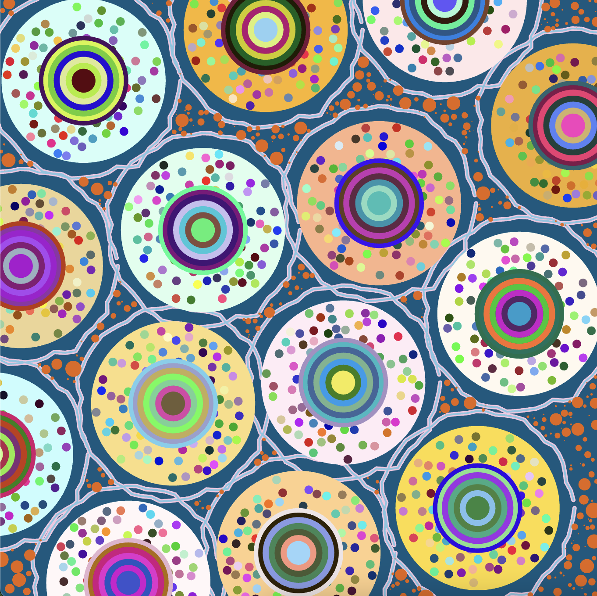

# Creative Coding Major Project
**Bethany Xue bxue0412** | Tutorial 8 Group A

## How to interact with the code

The work was animated with noise, so it should move as soon as the window is opened. No user interaction is needed.

## Individual approach
**Chosen method: perlin noise and randomness.**

### Unique elements
This code is different to the others in the group because all the unique animations have been created with noise or randomly generated.

Several properties of the image are animated:
- Wavy lines move around
- Random particles have been added to the background
- Colour of the background circles change slightly
- Diameter of the nested circles move in and out
- Diameter of the random circles inside the big circles also change 
- Outline of the big circle moves in and out

### Inspiration
I chose to animate with perlin code because it can add some interesting textures to the artwork. The shapes in the base group code are all very smooth:

*Our group code*

As can be seen in the inspiration artwork, a traditional painting should have a lot of subtle textures that come from the oil paint, brush strokes, and canvas. 

 
*Our group's inspiration artwork: Pacita Abad's Wheels of Fortune*

For inspiration of the animation movement, I referenced the film *Spider-Man: Across the Spider-Verse* (2023), which is an animated film with a comic book style.

In the beginning scene, radiating circles are used to match the sound of a character playing the drums. I felt inspired by the way these circles move when animating my own work.

I was also inspired by way the film was animated to look like a moving comic book. Many of the backgrounds had random textures and lines that look like shapes I can make with perlin noise and randomness.

 
 
 
*Screenshots of the film*

The scene I referenced can be viewed [here](https://www.youtube.com/watch?v=Ek40XtVsO7g).

### Technical Explanation
1. The background in draw() function has some transparency so that the previous frames can be seen. This technique was sourced from [here](https://genekogan.com/code/p5js-perlin-noise/ ).
2. Created variables to add noise to the green and blue factors of the background circles so that they flicker. A stroke is also added.
3. Noise added to the radius of the inner nested rings so that they move in and out. Also added white stroke.
4. Noise added to the diameter of the small random circles inside the big circles so that they change size slightly.
5. Noise added to the X coordinate of the pink wavy lines, and to the Y coordinate of the blue wavy lines, so that they move around the canvas randomly.
6. A function was created to draw pink particles randomly across the canvas. This code is from Week 10 lecture.
7. A function was created to generate another circle behind each of the big circles, which randomly moves between two sizes with easing. This code is from Week 9 tutorial.
8. All the variables that affect the noise are updated in the draw() function.
